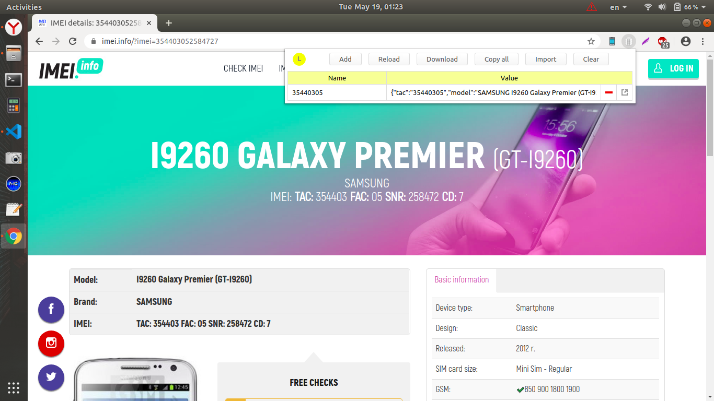
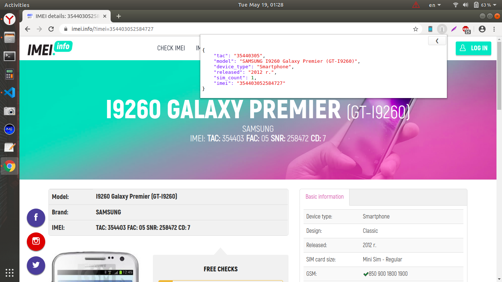

# IMEI.info parser
Google Chrome &amp; Opera Extension  
Парсер данных с сайта Imei.info  
Расширение срабатывает только на страницах заданных в файле manifest.json  
Данные сохраняются в LocalStorage (просмотр через LocalStorage Manager).  
  
# Установка расширения
### Если используем Оперу  
**1. Установить расширения для Opera Install Chrome Extensions**  
<https://addons.opera.com/ru/extensions/details/install-chrome-extensions/>  
  
**2. Установить расширение из магазина Chrome LocalStorage Manager**
<https://chrome.google.com/webstore/detail/localstorage-manager/fkhoimdhngkiicbjobkinobjkoefhkap>
  
**3. Заходим в opera://extensions/**  
* В правом верхнем углу активируем «Режим разработчика»  
* Нажимаем кнопку «Загрузить распакованное расширение»  
* На диске выбираем папку с расширением «imei_info_parser».  
  
### Если используем Chrome — 1й шаг не нужен.  

# Скриншоты
  

